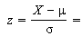
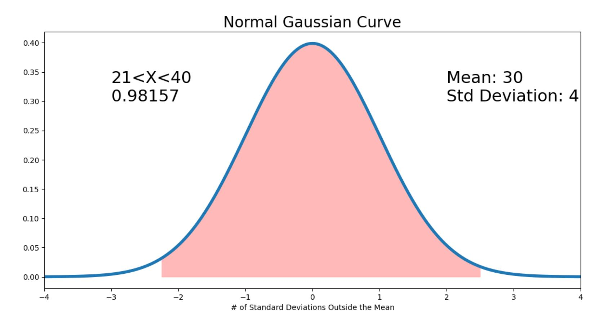

# Distributions

A distribution describes all the probable
outcomes of a variable.

<!-- TABLE OF CONTENTS -->
<details open="open">
  <summary>Table of Contents</summary>
  <ol>
    <li><a href="#about-the-project">About</a></li>
    <li>
      <a href="#getting-started">Getting Started</a>
      <ul>
        <li><a href="#prerequisites">Prerequisites</a></li>
        <li><a href="#installation">Installation</a></li>
      </ul>
    </li>
    <li><a href="#usage">Usage</a></li>
    <li><a href="#reference">Reference</a></li>
    <li><a href="#Contact">Contact</a></li>
  </ol>
</details>

# About The Project

To understand the working of the Distributions in the statistics and learning stats

### Repo Contains:
* [Continuous Distribution](#continuous-distribution)
    - [x] Normal Distribution
    - [ ] Exponential Distribution [# ToDo]
* [Discrete Distribution](#discrete-distribution)
    - [ ] Uniform Distribution [# ToDo]
    - [ ] Binominal Distribution [# ToDo]

<!-- Definitions -->
## Continuous Distribution
Continuous probability distribution is a type 
of distribution that deals with continuous types 
of data or random variables.

Continuous  Distributions are also knows as Probability 
density function.

- [Normal Distribution](#normal-distribution)
- Exponential Distribution
- Beta Distribution

## Discrete Distribution
A discrete distribution is a statistical distribution 
that shows the probabilities of outcomes with finite values.

Discrete probability distributions are also
called probability mass functions

- Uniform Distribution
- Binomial Distribution
- Bernoulli Distribution
- Poisson Distribution

# Getting Started
This is an example of how you may give instructions on setting up your project locally.
To get a local copy up and running follow these simple example steps.

## Prerequisites

Should have the Python 3 already installed in the system.
And need the ML libraries which can be installed from requirements.txt

The `requirements.txt` file will have Python libraries that your notebooks
depend on, and they will be installed using:

```
pip install -r requirements.txt
```

## Installation

Clone the repo 
```sh
   git clone https://github.com/ajayececit/distribution.git
```

## Usage

There are different function which can get the inputs from user
and give the probability distribution of the required distribution 
method

### Normal Distribution

Probability of the Normal Distribution always needed the 
Mean(μ), Standard Deviation(σ) and Probability Conditions as below
* Between P(a < X < b)
* Greater than P(X > a)
* Less than P(X < a)

#### Steps To Calculate the Normal Distribution

<font color="Grey"> Step 1: </font>
Calculate the standard score for the given X using below formula



where,
* X  &#8594; Probablity to find
* μ  &#8594; Mean
* σ  &#8594; Standard Deviation
* Z  &#8594; Standard Score

Once we get the Standard Score we can have a look in the [z-table](images/z_table.pdf) 
and find the final Probability

#### [Functions](https://github.com/ajayececit/distribution/blob/main/distributions/continious_distribution/normal_distribution.py) Which help calculate the probability
```sh
1) probability_normal_distribution_string(mean, std_deviation, input_string)
2) probability_normal_distribution(mean, std_deviation, lower_x, upper_x)
3) plot_distribution_graph(mean, std_deviation, input_string)
```
##### 1) probability_normal_distribution_string:
This function will get the Mean(μ), Standard Deviation(σ) and Probability Conditions as a string 
and able to calculate the Probability by handling all the edge cases.


##### 2) plot_distribution_graph:
This function will get the Mean(μ), Standard Deviation(σ) and Probability Conditions as a string 
and able to calculate the Probability by handling all the edge cases. And generate the Normal 
Distribution Graph like below



##### 3) probability_normal_distribution:
This function will get Mean(μ), Standard Deviation(σ) and Lower Value and Upper Value and calculate 
the Probability. This doesn't handle edge cases. Can handle Lower value and Upper Value. 
But not able to do the greater than and less than logic


### Reference
1) [wikipedia](https://en.wikipedia.org/wiki/List_of_probability_distributions)
2) [statistics how to](https://www.statisticshowto.com/)
3) [z-Table](https://www.math.arizona.edu/~rsims/ma464/standardnormaltable.pdf)

### Contact
[LinkedIn](https://www.linkedin.com/in/ajay-balakumaran-0880819a/)
